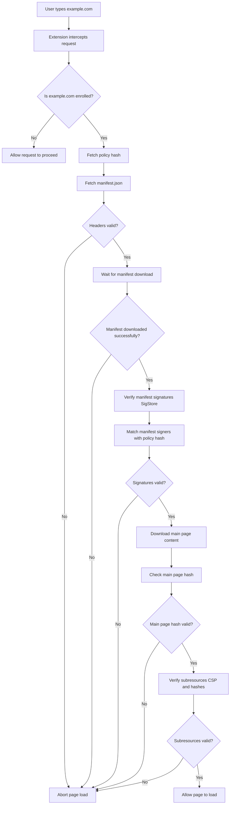
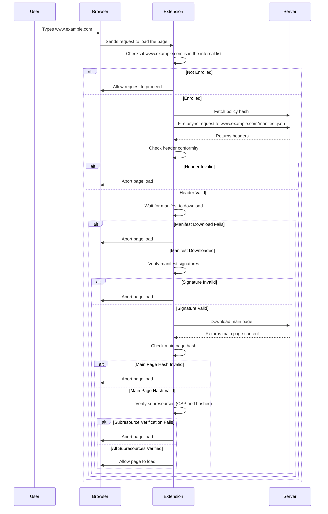

## Webcat Browser Extension

The extension is written mostly in TypeScript, using the Manifest V2 API. It is very unlikely that a port to Manifest V3 would be possible, as it relies heavily on intercepting and modifying network requests and responses. There are no runtime dependencies, and it uses only the [Web Crypto API](https://developer.mozilla.org/en-US/docs/Web/API/Web_Crypto_API) including the TUF, Sigstore and Sigsum clients. The only exception are the WebAssembly hooks where a synchronous SHA256 function is needed in order to hook synchronous WebAssembly methods.

### Build

Install build dependencies:

`npm install`

Compile the TypeScript and package it into a single file using [Vite](https://vite.dev):

`npm run build`

The output will be in `./bundle/bundle.js`. Everything else in the extension folder does not need any action. The extension can be loaded in debug mode by loading the `manifest.json` after the build command.

Alternatively, `make build` will build, package, and clean the extension, saving the archive as `../dist/webcat-extension.zip`.

### Tests

There is currently a very limited test suite supported, mostly to showcase the structure and scaffholding. Tests use [vitest](https://vitest.dev/) and can be run both natively, or in [playwright](https://playwright.dev/). In the future, while some test will keep running in both modes, some others will explicitly require the full browser environment.

`npm run test`

Or, for playwright:

```
npm install @vitest/browser playwright
npx playwright install
npm run test:playwright
```

### Linting

The project currently use [eslint](eslint.config.mjs) for linting and prettifier for sorting imports and style consistency. Both are run together with:

`npm run lint`

### Decision tree



### Sequence diagram


