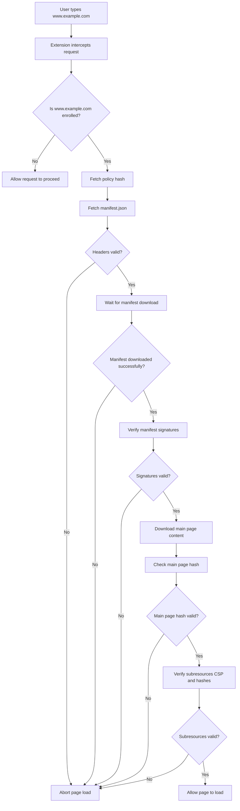
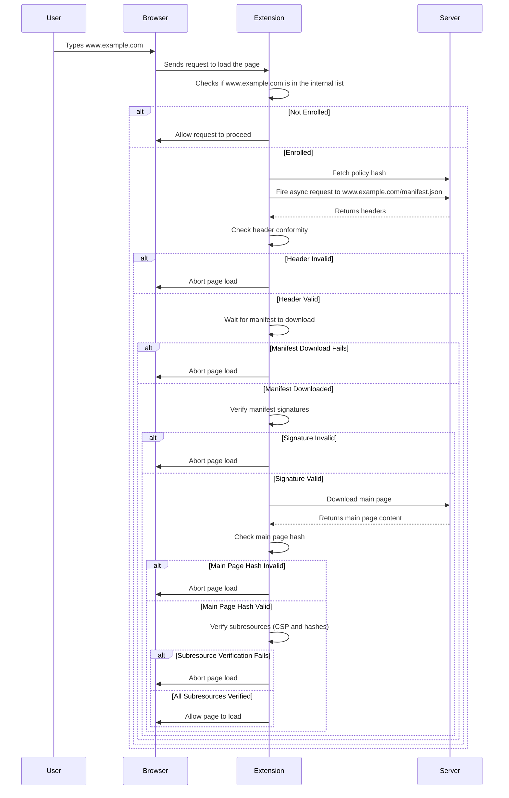

## Webcat Browser Extension

The extension is written mostly in TypeScript, using the Manifest V2 API. It is very unlikely that a port to Manifest V3 would be possible, as it relies heavily on intercepting and changing network requests and responses.

### Features

- No runtime dependencies: everything has been written from scratch and does not depend on any third-party package (no polyfills)
- Native crypto: every cryptographic operation, from TUF to Sigstore, to Webcat uses only the native [Web Crypto API](https://developer.mozilla.org/en-US/docs/Web/API/Web_Crypto_API)
- Small footprint: currently, the compiled code is ~30KB
- Failsafe: invalid scripts are discarded at the network level
- Fast: the extension's impact on non-enrolled websites is negligible

### Build

Install build dependencies:

`npm install`

Compile the TypeScript and package it into a single file using [Vite](https://vite.dev):

`npm run build`

The output will be in `./bundle/bundle.js`. Everything else in the extension folder does not need any action. The extension can be loaded in debug mode by loading the `manifest.json` after the build command.

Alternatively, `make build` will build, package, and clean the extension, saving the archive as `../dist/webcat-extension.zip`.

## Validation logic

_WARNING_: experimental diagrams. Conformity with the code to be verified.

### Decision tree

### Sequence diagram

