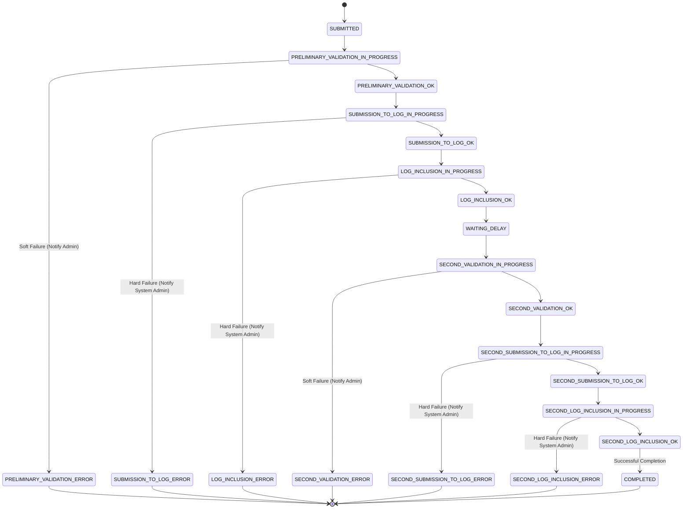

## Queue processor
`queue.py` is the script responsible for processing and validating the submissions sent via the [List API](https://github.com/freedomofpress/webcat/tree/main/list_server#list-api) (or its [graphical frontend](https://github.com/freedomofpress/webcat/blob/main/web/list.html)).

The validation process is currently dicussed in https://github.com/freedomofpress/webcat/issues/8.

The CSP requirements are currently dicussed in https://github.com/freedomofpress/webcat/issues/9.

As we are in a proof of concept state, this logix is highly experimental and feedback is welcome.

### Processing list changes
#### Type of changes
There are three possible user requested actions:
 - `ADD`
 - `MODIFY`
 - `DELETE`

And the following possible system actions:
 - `DOMAIN_DELETED`: the included domain is no longer registered, and it should be marked for removal.
 - `SERVICE_MODIFIED`: community-supported emergency change, such as a high profile compromise has happened and it is reasonable not to wait `WAITING_DELAY` for changes.

They have different configuration requirements in order to be succesful, but they follow a very similar validation logic, with mostly the same steps involved.

#### Submission statuses
 - *Final* does not allow for retries: the requested change is discarded and the admin contact is notified.
 - **Needs Investigation* does not allow retries. However, the failure happened in an unexpected situation (such as, the transparency log personality detected inconsistencies). This should never happen, but if it does, the incident must be investigated,

| **Current Phase**       | **Status Code**                       | **Final** | **Needs Investigation** | **Description**                                                                                 | **Next Successful State**                 | **Next Error State**                 |
|--------------------------|---------------------------------------|-----------|--------------------------|-------------------------------------------------------------------------------------------------|------------------------------------------|---------------------------------------|
| Submission              | SUBMITTED                            | No        | No                       | Submission accepted in the queue.                                                              | PRELIMINARY_VALIDATION_IN_PROGRESS       | -                                     |
| Preliminary Validation  | PRELIMINARY_VALIDATION_IN_PROGRESS   | No        | No                       | Preliminary validation in progress.                                                            | PRELIMINARY_VALIDATION_OK                | PRELIMINARY_VALIDATION_ERROR          |
| Preliminary Validation  | PRELIMINARY_VALIDATION_OK            | No        | No                       | Preliminary validation succeeded.                                                              | SUBMISSION_TO_LOG_IN_PROGRESS            | -                                     |
| Preliminary Validation  | PRELIMINARY_VALIDATION_ERROR         | Yes       | No                       | Preliminary validation failed.                                                                 | -                                        | -                                     |
| Submission to Log       | SUBMISSION_TO_LOG_IN_PROGRESS        | No        | No                       | Transparency Log submission in progress.                                                      | SUBMISSION_TO_LOG_OK                     | SUBMISSION_TO_LOG_ERROR               |
| Submission to Log       | SUBMISSION_TO_LOG_OK                 | No        | No                       | Transparency Log submission succeeded.                                                        | LOG_INCLUSION_IN_PROGRESS                | -                                     |
| Submission to Log       | SUBMISSION_TO_LOG_ERROR              | Yes       | Yes                      | Transparency Log submission failed.                                                           | -                                        | -                                     |
| Log Inclusion           | LOG_INCLUSION_IN_PROGRESS            | No        | No                       | Waiting for the Transparency API to return the inclusion proof.                               | LOG_INCLUSION_OK                         | LOG_INCLUSION_ERROR                   |
| Log Inclusion           | LOG_INCLUSION_OK                     | No        | No                       | First inclusion proof received from Transparency Log.                                         | WAITING_DELAY                            | -                                     |
| Log Inclusion           | LOG_INCLUSION_ERROR                  | No        | Yes                      | The transparency log has failed to merge the leaf.                                            | -                                        | -                                     |
| Waiting Period          | WAITING_DELAY                        | No        | No                       | Waiting for the set delay before sending again to the Transparency Log.                       | SECOND_VALIDATION_IN_PROGRESS            | -                                     |
| Secondary Validation    | SECOND_VALIDATION_IN_PROGRESS        | No        | No                       | Second validation in progress.                                                                | SECOND_VALIDATION_OK                     | SECOND_VALIDATION_ERROR               |
| Secondary Validation    | SECOND_VALIDATION_OK                 | No        | No                       | Second validation succeeded.                                                                  | SECOND_SUBMISSION_TO_LOG_IN_PROGRESS     | -                                     |
| Secondary Validation    | SECOND_VALIDATION_ERROR              | Yes       | No                       | Second validation failed.                                                                     | -                                        | -                                     |
| Second Submission to Log| SECOND_SUBMISSION_TO_LOG_IN_PROGRESS | No        | No                       | Second Transparency Log submission in progress.                                               | SECOND_SUBMISSION_TO_LOG_OK              | SECOND_SUBMISSION_TO_LOG_ERROR        |
| Second Submission to Log| SECOND_SUBMISSION_TO_LOG_OK          | No        | No                       | Second Transparency Log submission succeeded.                                                 | SECOND_LOG_INCLUSION_IN_PROGRESS         | -                                     |
| Second Submission to Log| SECOND_SUBMISSION_TO_LOG_ERROR       | Yes       | Yes                      | Second Transparency Log submission failed.                                                    | -                                        | -                                     |
| Second Log Inclusion    | SECOND_LOG_INCLUSION_IN_PROGRESS     | No        | No                       | Waiting for the entry to be inserted into the Transparency Log.                               | SECOND_LOG_INCLUSION_OK                  | SECOND_LOG_INCLUSION_ERROR            |
| Second Log Inclusion    | SECOND_LOG_INCLUSION_OK              | No        | No                       | Entry successfully inserted into the Transparency Log.                                        | COMPLETED                                | -                                     |
| Second Log Inclusion    | SECOND_LOG_INCLUSION_ERROR           | No        | Yes                      | The transparency log has failed to merge the leaf.                                            | -                                        | -                                     |
| Completion              | COMPLETED                            | Yes       | No                       | Procedure successfully completed. The Preload list has been updated.                          | -                                        | -                                     |

#### State diagram

